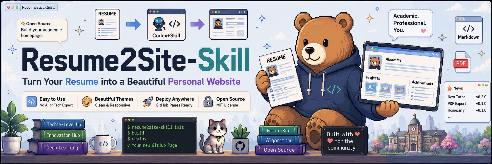
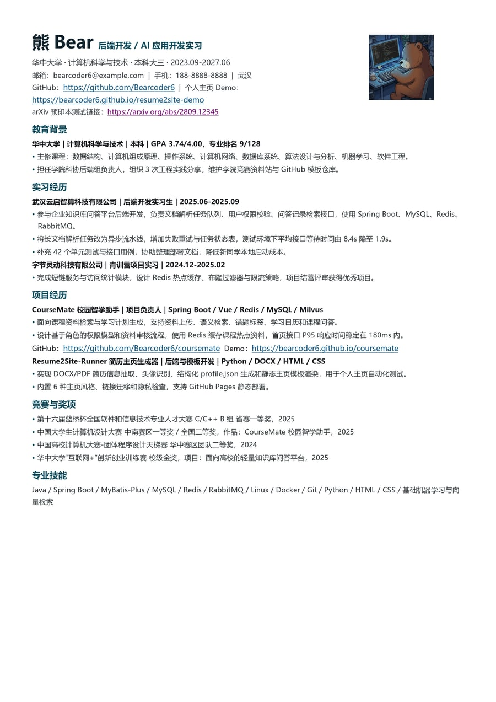
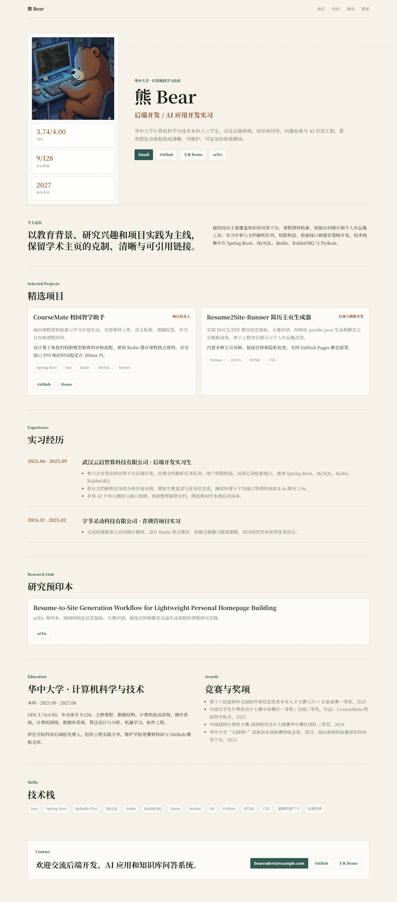
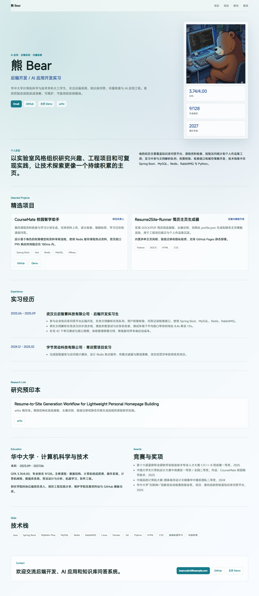
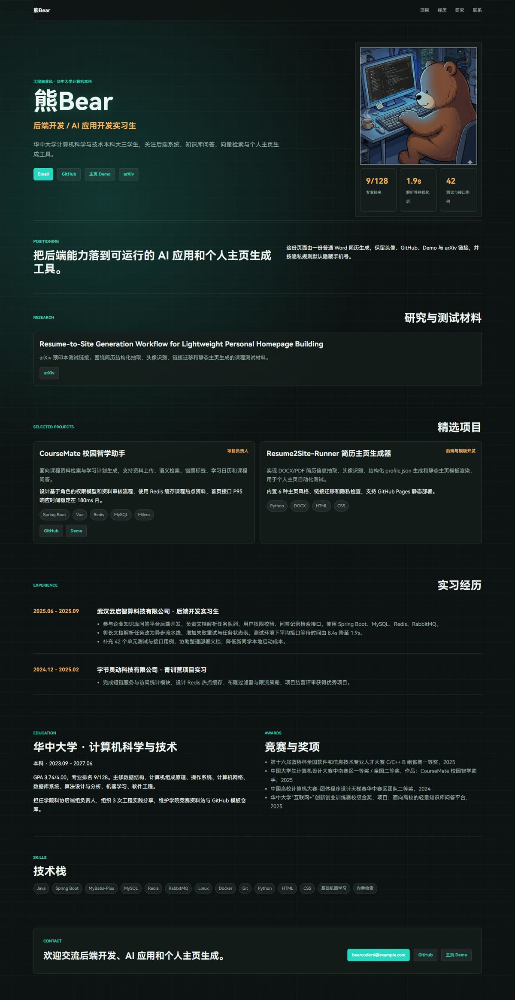
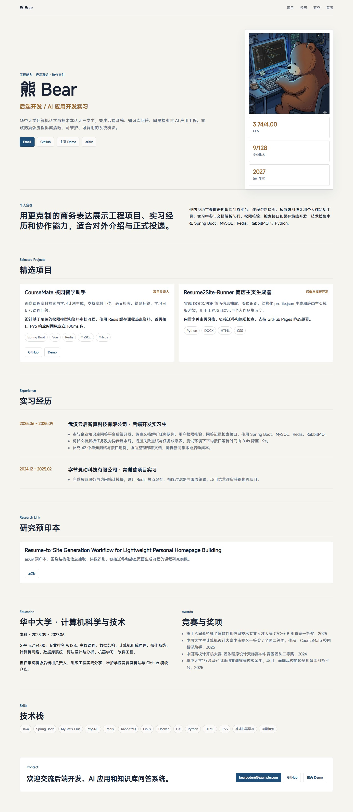
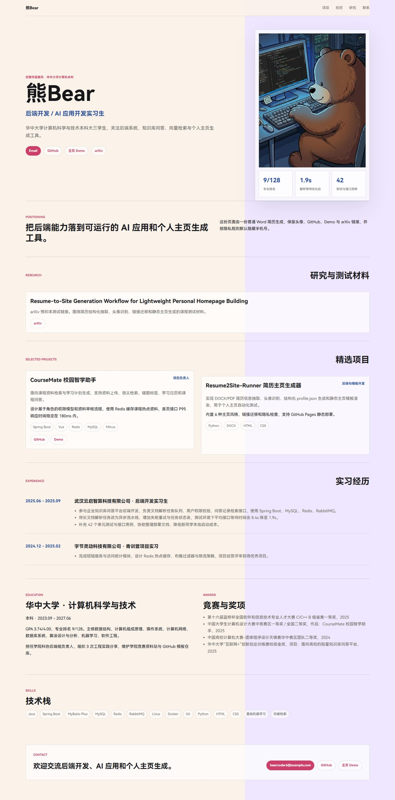
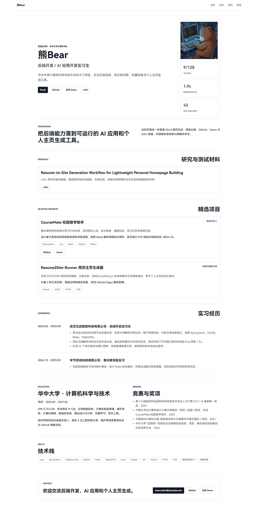

# Resume2Site-Skill

<p align="center">
  
</p>

<p align="center">
  <strong>把一份简历交给 Codex / Claude Code / Cursor，让它生成一个精致的个人主页。</strong>
</p>

<p align="center">
  
  
  
  
</p>

<p align="center">
  <a href="#showcase">效果展示</a> ·
  <a href="#quick-start">快速开始</a> ·
  <a href="#styles">内置风格</a> ·
  <a href="#deploy">部署</a>
</p>

> Resume2Site-Skill is a lightweight Agent Skill, not a CLI or SaaS product. English documentation is available in the folded section below.

<a id="showcase"></a>

## ✨ 效果展示

下面 6 个效果图来自同一份普通 Word 简历。Resume2Site-Skill 会先抽取事实和头像，再根据用户选择的风格生成 GitHub Pages-ready 静态主页。

<p align="center">
  
</p>

| Academic Editorial | Academic Lab | Engineering Commercial |
|---|---|---|
|  |  |  |

| Business Polished | Creative Portfolio | Minimal Resume Site |
|---|---|---|
|  |  |  |

<details open>
<summary><strong>中文说明</strong></summary>

## 这是什么

Resume2Site-Skill 是一个轻量级 Agent Skill，用来指导 Codex、Claude Code、Cursor 等编程智能体，把简历转换成一个可以部署到 GitHub Pages 的个人主页。

它不是命令行工具、SaaS、爬虫、解析器、Python 包、npm 包或完整建站系统。它的价值是给 Agent 一套稳定工作流：

| 环节 | Skill 会要求 Agent 做什么 |
|---|---|
| 信息抽取 | 先生成 `work/profile.json`，再写网页 |
| 风格询问 | 生成前让用户选择内置主页风格 |
| 头像恢复 | 优先保留上传头像、DOCX 内嵌图或可靠的 PDF/页面裁剪头像 |
| 链接迁移 | 保留 GitHub、arXiv、DOI、Scholar、Demo、作品集等公开链接 |
| 隐私保护 | 默认不公开手机号，不把原始简历塞进网页 |
| 视觉规则 | 使用内置风格规范，避免模板味和 AI 味 |
| 轻量检查 | 不强制截图、Playwright、浏览器自动化或本地 dev server |
| 编码安全 | 生成 HTML / JSON / Markdown / CSS 时使用 UTF-8 |

<a id="quick-start"></a>

## 快速开始

把这个 GitHub 链接发给 Codex，然后直接说：

```text
请安装并使用这个 Skill：
https://github.com/Bearcoder6/Resume2Site-Skill.git

用 Resume2Site Skill 把我的简历生成一个精致的个人主页。
生成前先让我选择内置风格。
除非我明确同意，不要公开我的手机号。
保留简历里的 GitHub、arXiv、DOI、Scholar、Demo、作品集等公开链接。
输出一个适配 GitHub Pages 的静态网站。
```

如果你的 Codex 环境支持从 GitHub 安装 Skill，它可以直接安装。如果不支持，可以手动安装：

```bash
git clone https://github.com/Bearcoder6/Resume2Site-Skill.git
cd Resume2Site-Skill
mkdir -p ~/.codex/skills
cp -R skills/resume2site ~/.codex/skills/resume2site
```

Windows PowerShell：

```powershell
git clone https://github.com/Bearcoder6/Resume2Site-Skill.git
Set-Location Resume2Site-Skill
New-Item -ItemType Directory -Force "$env:USERPROFILE\.codex\skills" | Out-Null
Copy-Item -Recurse -Force ".\skills\resume2site" "$env:USERPROFILE\.codex\skills\resume2site"
```

不需要 `pip install` 或 `npm install`，也没有 `resume2site build` 命令。

## 推荐输入

推荐优先使用 **Word `.docx`**，其次是 **PDF**。纯文本和 Markdown 目前还在测试开发中。

```text
input/
  resume.docx 或 resume.pdf
  resume.txt 或 resume.md   测试中
  avatar.png
  github_links.txt
  paper_links.txt
  website_links.txt
  style_preference.txt
  references/
```

用户不需要提前整理成这个目录结构；如果已经给了具体文件路径，Agent 应直接使用。

## 输出结构

```text
work/
  profile.json
  site-plan.md
  asset-recommendations.md
  final-review.md

output/site/
  index.html
  styles.css
  assets/
  README.md
  .nojekyll
  ASSET_CREDITS.md
```

打开 `output/site/index.html` 就能本地预览网页。

<a id="styles"></a>

## 内置风格

Agent 读取简历后，会推荐一个风格，并让用户选择：

| 风格 | 适合场景 |
|---|---|
| `academic-editorial` | 学术主页，适合论文、教育经历、研究方向、导师、基金等内容 |
| `academic-lab` | 学术实验室感，适合 AI、数据、工程、机器人、系统、应用研究 |
| `engineering-commercial` | 工程商业风，适合开发、算法、数据、云原生、安全等求职主页 |
| `business-polished` | 商务精致风，适合产品、咨询、运营、金融、管理、企业服务 |
| `creative-portfolio` | 创意作品集，适合设计、媒体、写作、营销、创作者、客户作品 |
| `minimal-resume-site` | 极简正式风，适合内容较少、保守正式、快速生成的一页式主页 |

风格名只作为内部选项记录在 `work/site-plan.md`，不会显示在最终用户网页里。

<a id="deploy"></a>

## 发布到 GitHub Pages

生成结果是一组静态文件。想挂到 GitHub Pages，可以这样做：

1. 新建一个 GitHub 仓库，用来放个人主页。
2. 把 `output/site/` 里的所有文件复制到这个仓库。
3. 推送到 GitHub。
4. 进入仓库 `Settings` → `Pages`，选择从 `main` 分支根目录部署。

如果你想做 `username.github.io` 这种用户主页，仓库名要写成自己的 `username.github.io`。如果只是项目主页，一般会发布到 `https://username.github.io/repository-name/`。

## Skill 会保护什么

- 不编造工作、奖项、论文、指标、职位、导师或机构。
- 不把原始简历复制进公开输出。
- 不默认公开手机号。
- 尽量保留简历里的真实头像；如果提取失败，会记录原因。
- 保留 GitHub、arXiv、DOI、Scholar、个人网站、Demo、数据集、视频、作品集等公开链接。
- 使用官方或可信开源图标；没有可靠图标时使用文字标签。
- 使用图片素材前检查授权、分辨率和视觉适配度。
- 生成后执行轻量文件级质量检查，并进行一次 polish。
- 生成 HTML 时包含 `<meta charset="utf-8">`，并使用 UTF-8 写入文本文件。

## 仓库结构

```text
SKILL.md                         Agent 入口提示
skill.json                       轻量元数据
skills/resume2site/              可安装的主 Skill
skills/resume2site/prompts/      Agent prompts
skills/resume2site/templates/    输出结构参考
skills/resume2site/examples/     虚构学术/求职示例
docs/                            辅助说明和项目图片
assets/                          README 展示图
```

## License

MIT.

</details>

<details>
<summary><strong>English README</strong></summary>

## What Is It

Resume2Site-Skill is a lightweight Agent Skill for Codex, Claude Code, Cursor, and other coding agents. It helps an agent convert a resume into a polished, desktop-first personal website that can be deployed to GitHub Pages.

It is not a CLI, SaaS app, crawler, parser, Python package, npm package, or full website builder. The value is the workflow: fact extraction, style intake, design rules, privacy rules, asset rules, link preservation, and final quality review.

| Stage | What the Skill asks the agent to do |
|---|---|
| Resume extraction | Create `work/profile.json` before writing HTML |
| Style intake | Ask the user to choose a built-in style before generating |
| Avatar recovery | Preserve uploaded avatars, DOCX embedded images, or reliable PDF/page crops |
| Link preservation | Keep GitHub, arXiv, DOI, Scholar, demo, project, and portfolio links |
| Privacy guard | Avoid publishing phone numbers or raw resumes by default |
| Visual system | Apply built-in style rules instead of generic templates |
| Lightweight review | Do not require screenshots, Playwright, browser automation, or a local dev server |
| Encoding safety | Write HTML / JSON / Markdown / CSS as UTF-8 |

## Quick Start

Give this repository link to Codex and paste a prompt like this:

```text
Please install and use this Skill:
https://github.com/Bearcoder6/Resume2Site-Skill.git

Use the Resume2Site Skill to turn my resume into a polished personal website.
Ask me to choose one of the built-in style variants before generating the site.
Do not publish my phone number unless I explicitly approve it.
Preserve public GitHub, arXiv, DOI, Scholar, demo, and portfolio links.
Create a GitHub Pages-ready static site.
```

If your Codex environment supports installing skills from GitHub, it can install the Skill directly. Otherwise, install it manually:

```bash
git clone https://github.com/Bearcoder6/Resume2Site-Skill.git
cd Resume2Site-Skill
mkdir -p ~/.codex/skills
cp -R skills/resume2site ~/.codex/skills/resume2site
```

Windows PowerShell:

```powershell
git clone https://github.com/Bearcoder6/Resume2Site-Skill.git
Set-Location Resume2Site-Skill
New-Item -ItemType Directory -Force "$env:USERPROFILE\.codex\skills" | Out-Null
Copy-Item -Recurse -Force ".\skills\resume2site" "$env:USERPROFILE\.codex\skills\resume2site"
```

No package install is required. There is no `resume2site build` command.

## Recommended Inputs

Recommended input format: **Word `.docx` first**, **PDF second**. Plain text and Markdown inputs are currently experimental.

```text
input/
  resume.docx or resume.pdf
  resume.txt or resume.md   experimental
  avatar.png
  github_links.txt
  paper_links.txt
  website_links.txt
  style_preference.txt
  references/
```

The user does not need to prepare this exact folder structure. If concrete file paths are provided, the agent should use them directly.

## Expected Output

```text
work/
  profile.json
  site-plan.md
  asset-recommendations.md
  final-review.md

output/site/
  index.html
  styles.css
  assets/
  README.md
  .nojekyll
  ASSET_CREDITS.md
```

Open `output/site/index.html` to preview the generated website locally.

## Built-In Styles

After reading the resume, the agent recommends one style and asks the user to choose:

| Variant | Best for |
|---|---|
| `academic-editorial` | Academic homepages with papers, education, research, advisors, or grants |
| `academic-lab` | AI, data, engineering, robotics, systems, or applied research profiles |
| `engineering-commercial` | Developer, algorithm, data, cloud, security, and job-seeking technical profiles |
| `business-polished` | Product, consulting, operations, finance, management, and enterprise-facing profiles |
| `creative-portfolio` | Design, media, writing, marketing, creators, and client-facing work |
| `minimal-resume-site` | Conservative, sparse, formal, or fast one-page personal sites |

Style variant names are internal implementation details and should be recorded in `work/site-plan.md`, not shown in the public page copy.

## Publish To GitHub Pages

The generated site is just static files:

1. Create a GitHub repository for your personal website.
2. Copy everything inside `output/site/` into that repository.
3. Push the repository to GitHub.
4. Open repository `Settings` → `Pages`, then deploy from the `main` branch root.

For a user site such as `username.github.io`, name the repository exactly `username.github.io`. For a project site, GitHub Pages will usually publish it under `https://username.github.io/repository-name/`.

## Safety Rules

- Do not invent jobs, awards, publications, metrics, titles, advisors, or affiliations.
- Do not copy raw resumes into public output.
- Do not publish phone numbers unless the user approves.
- Preserve real resume portraits when possible and record a note if extraction fails.
- Preserve public GitHub, arXiv, DOI, Scholar, website, demo, dataset, video, and portfolio links.
- Use official or reputable open icons when available; otherwise use text labels.
- Check visual assets for license, resolution, and fit before use.
- Run a lightweight file-based review and make one polish pass.
- Include `<meta charset="utf-8">` in generated HTML and write text files as UTF-8.

## Repository Structure

```text
SKILL.md                         Root pointer for agents
skill.json                       Lightweight metadata
skills/resume2site/              Main installable Skill
skills/resume2site/prompts/      Agent prompts
skills/resume2site/templates/    Reference output structures
skills/resume2site/examples/     Fake academic and landing examples
docs/                            Supporting notes and images
assets/                          README showcase images
```

## License

MIT.

</details>
